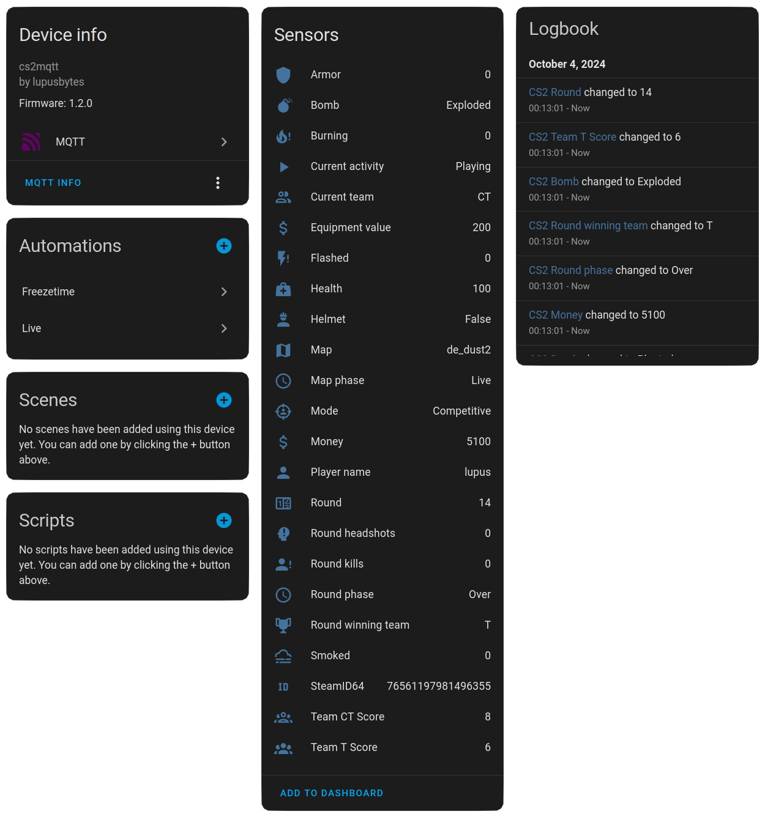
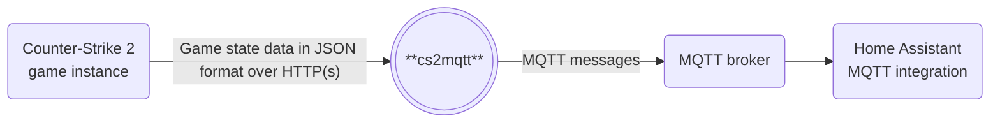
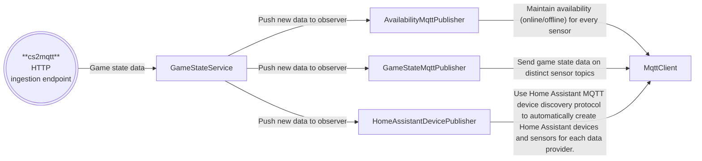

<p align="center">
    <a href="https://github.com/lupusbytes/cs2mqtt/actions/workflows/build.yml"></a>
    <a href="https://github.com/lupusbytes/cs2mqtt/actions/workflows/docker.yml"></a>
    <a href="https://codecov.io/gh/lupusbytes/cs2mqtt"></a>
    <a href="https://sonarcloud.io/summary/new_code?id=lupusbytes_cs2mqtt"></a>
    <a href="https://sonarcloud.io/summary/new_code?id=lupusbytes_cs2mqtt"></a>
    <a href="https://sonarcloud.io/summary/new_code?id=lupusbytes_cs2mqtt"></a>
</p>
<p align="center">
  
<p>

# Introduction

This project allows you to integrate your [Counter-Strike 2](https://store.steampowered.com/app/730/CounterStrike_2/) game with [Home Assistant](https://www.home-assistant.io/) by exposing it as an [MQTT device](https://www.home-assistant.io/integrations/mqtt/).
Its purpose is to enable you to automate your smart home based on in-game events and information, enhancing your overall gaming experience.

**cs2mqtt** is cross-platform and can run locally on your gaming machine, or any server device. All communication happens entirely within your local network, no data is sent to the cloud.

## Counter-Strike as a Home Assistant MQTT device
If the [MQTT integration](https://www.home-assistant.io/integrations/mqtt/) is installed, **cs2mqtt** will automatically create MQTT devices using the [MQTT Discovery protocol](https://www.home-assistant.io/integrations/mqtt/#mqtt-discovery), with all values configured as [sensors](https://www.home-assistant.io/integrations/sensor.mqtt/).



# Getting started
**cs2mqtt** is designed to run as a container. You can use any OCI-compliant runtime to host the application. 

If you're using Home Assistant Operating System, you can simply install the application as an add-on, as described below.

## Running **cs2mqtt** as a Home Assistant add-on
[](https://my.home-assistant.io/redirect/supervisor_add_addon_repository/?repository_url=https%3A%2F%2Fgithub.com%2Flupusbytes%2Fcs2mqtt)

Add this repository as an add-on using the button above, or manually:
 go to the **Add-on store** → top-right hamburger menu → **Repositories** → Add
`https://github.com/lupusbytes/cs2mqtt`.

Configure the add-on and Counter-Strike by following the readme on the info page inside the add-on.

## Running **cs2mqtt** with Docker Compose

In this example, it is expected that an MQTT broker, such as [Mosquitto](https://mosquitto.org/), is already set up and configured with the [MQTT integration](https://www.home-assistant.io/integrations/mqtt/) in [Home Assistant](https://www.home-assistant.io/).

### docker-compose.yml

```yaml
services:
  cs2mqtt:
    image: ghcr.io/lupusbytes/cs2mqtt:latest
    container_name: cs2mqtt
    ports:
      - "5000:8080"
    environment:
      MQTT__Host: 127.0.0.1         # MQTT broker address
      MQTT__Port: 1883              # MQTT broker port
      MQTT__UseTLS: false           # Set to true if your broker uses TLS (optional, default: false)
      MQTT__Username: c2m           # MQTT client username (optional)
      MQTT__Password: password      # MQTT client password (optional)
      MQTT__ClientId: cs2mqtt       # MQTT client ID (optional)
      MQTT__ProtocolVersion: 5.0.0  # Allowed values are 3.1.0, 3.1.1, or 5.0.0 (optional, default: 5.0.0)
      
    restart: unless-stopped
```
 
>⚠️ Make sure you replace the host, username, and password with values matching your setup. 
If the broker is configured to allow anonymous access, the username and password can be omitted.

## Connecting **Counter-Strike 2** to **cs2mqtt**

To make **Counter-Strike 2** send game state data to **cs2mqtt**, you need to create a config file within the game's directory.

If **Steam** and **Counter-Strike 2** are installed with default options, the path where you need to create your config is:

```
C:\Program Files (x86)\Steam\steamapps\common\Counter-Strike Global Offensive\game\csgo\cfg
```

Once you have located the correct path, create a new file there called **gamestate_integration_cs2mqtt.cfg** with the following content:

```
"cs2mqtt"
{
 "uri" "http://<YOUR-CS2MQTT-SERVER-IP>:5000"
 "timeout" "5.0"
 "buffer"  "0.1"
 "throttle" "0.1"
 "heartbeat" "5.0"
 "data"
 {
   "provider"            "1" 
   "map"                 "1"      
   "round"               "1"
   "player_id"           "1"
   "player_state"        "1"
 }
}
```

> 💡 Tip
>
>In Windows File Explorer, it can be tricky to create a new file with a specific file extension (like `.cfg`).  
A simple workaround is to copy one of the many pre-existing `.cfg` files in the folder, rename it, and then replace its contents using Notepad.

>⚠️ Make sure you replace the `uri` with the IP address or hostname of the host that is running **cs2mqtt**.

The next time you launch **Counter-Strike 2**, **cs2mqtt** will use the [MQTT discovery protocol](https://www.home-assistant.io/integrations/mqtt/#mqtt-discovery) to make [Home Assistant](https://www.home-assistant.io/) create an MQTT device named `CS2 STEAM_{X}:{Y}:{Z}`, matching your SteamID. On the very first game launch, the device will not have many sensors, but after joining or creating a game server, all sensors will automatically be discovered.

# Architecture
**cs2mqtt** receives its data from the built-in [Counter-Strike Game State Integration](https://developer.valvesoftware.com/wiki/Counter-Strike:_Global_Offensive_Game_State_Integration) engine. This integration is created by Valve and is safe to use and will not be flagged by anti-cheat systems such as [VAC](https://help.steampowered.com/en/faqs/view/571A-97DA-70E9-FF74) or [FACEIT](https://www.faceit.com/en/anti-cheat).



Internally, **cs2mqtt** keeps track of the current state of every connected Counter-Strike game instance.
Inside the Counter-Strike game, every game state change will trigger the game to send a full payload containing both the changed and unchanged state data.
**cs2mqtt** compares the received data to its in-memory cache, updates the cache accordingly, and asynchronously submits the changed data as MQTT messages to the MQTT broker.



## System availability
On startup, when **cs2mqtt** connects to the MQTT broker, it publishes an `online` message to `cs2mqtt/status`.
It also sets a Last Will and Testament (LWT) for the MQTT broker to publish an `offline` message to this topic if it loses connection or terminates unexpectedly.
On graceful shutdown, **cs2mqtt** will publish an offline message to this topic before disconnecting.

## Device availability
When a Counter-Strike 2 game instance submits data for the first time, **cs2mqtt** will automatically create an MQTT device for it, as described [above](#counter-strike-as-a-home-assistant-mqtt-device), and publish online messages to `cs2mqtt/{steamId64}/+/status` topics.
If a player disconnects from a game server, the topics related to `player_state`, `map`, and `round` will immediately be set to `offline`.
When a player closes their Counter-Strike 2 game, there is no data transmitted, and there's nothing to indicate they've quit. As a result, **cs2mqtt** listens for heartbeats and eventually sets the entire device to an offline availability state once the timeout is reached.


# Advanced configuration

## Authentication
It is possible to require authentication between **Counter-Strike 2** and **cs2mqtt**.  
To do this, pick a password and add it as an environment variable in the **cs2mqtt** docker-compose.yml like:

```yaml
GameState__Token: password
```

Then also add the same password to **gamestate_integration_cs2mqtt.cfg** in the root object:

```
"auth"
{
  "token" "password"
}
```

## Limiting what game state data is sent

It is possible to remove any of the following entries from the data object in **gamestate_integration_cs2mqtt.cfg**:  
- `map`
- `round`
- `player_id`
- `player_state`

This will stop **Counter-Strike 2** from sending data about the removed topics.

## Data from spectated players
Since version `1.9.0`, cs2mqtt ignores data from spectated players by default.
This behaviour can be changed by setting the environment variables 
```yaml
GameState__IgnoreSpectatedPlayers: false
```

## Device timeout
As mentioned in [Device Availability](#device-availability), CS2 can and will **not** notify **cs2mqtt** when the game is closed. To work around this limitation, **cs2mqtt** listens for heartsbeats and sets the device as offline if no data has been received within the expected interval.
The timeout and cleanup interval can be defined by following environment variables:
```yaml
GameState__TimeoutInSeconds: 10.5
GameState__TimeoutCleanupIntervalInSeconds: 5
```
The `TimeoutInSeconds` should be a little longer than the heartbeat defined in the **gamestate_integration_cs2mqtt.cfg**, to get the best results. 

The `TimeoutCleanupIntervalInSeconds` defines how often the background job that checks for timed out devices is executed.

# Resources
- [Valve Counter-Strike Game State Integration](https://developer.valvesoftware.com/wiki/Counter-Strike:_Global_Offensive_Game_State_Integration)
- [Reddit thread with in-depth information about Game State Integration](https://www.reddit.com/r/GlobalOffensive/comments/cjhcpy/game_state_integration_a_very_large_and_indepth/)
- [cs2mqtt reddit announcement thread with crazy automation ideas in the comments](https://www.reddit.com/r/homeassistant/comments/1nkaqfc/counterstrike_as_a_home_assistant_mqtt_device/)
- [Ulanzi clock automation video](https://streamable.com/xz67rm)  
[Ulanzi clock automation yaml](https://www.reddit.com/r/homeassistant/comments/1nkaqfc/comment/nfecuul/?utm_source=share&utm_medium=web3x&utm_name=web3xcss&utm_term=1&utm_content=share_button)
