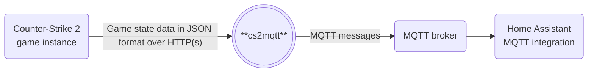
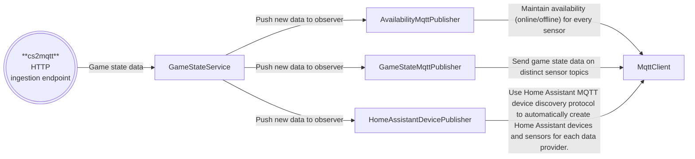

    
    
    
    
    
    

# cs2mqtt

## Introduction

This project allows you to integrate your [Counter-Strike 2](https://store.steampowered.com/app/730/CounterStrike_2/) game with [Home Assistant](https://www.home-assistant.io/) by exposing it as an [MQTT device](https://www.home-assistant.io/integrations/mqtt/).
Its purpose is to enable you to automate your smart home based on in-game events and information, enhancing your overall gaming experience.

**cs2mqtt** is cross-platform and can run locally on your gaming machine or any server device.

## Architecture
**cs2mqtt** receives its data from the built-in [Counter-Strike Game State Integration](https://developer.valvesoftware.com/wiki/Counter-Strike:_Global_Offensive_Game_State_Integration) engine. This integration is created by Valve and is safe to use and will not be flagged by anti-cheat systems such as [VAC](https://help.steampowered.com/en/faqs/view/571A-97DA-70E9-FF74) or [FACEIT](https://www.faceit.com/en/anti-cheat).

Internally, **cs2mqtt** keeps track of the current state of every connected Counter-Strike game instance.
Inside the Counter-Strike game, every game state change will trigger the game to send a full payload containing both the changed and unchanged state data.
**cs2mqtt** compares the received data to its in-memory cache, updates the cache accordingly, and asynchronously submits the changed data as MQTT messages to the MQTT broker.

